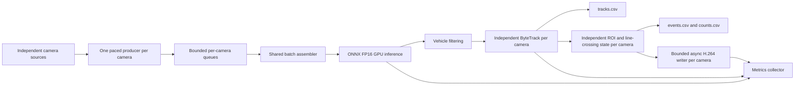

# Multi-Camera Real-Time Traffic Analytics

A backpressure-aware pipeline that performs batched ONNX FP16 inference and
independent per-camera vehicle tracking on multiple real-time video streams.

**Project status:** Phase 4 is complete: detection, camera-local tracking,
polygonal ROIs, directional line crossing, structured counts/events, and
asynchronous annotated output are implemented and validated. Phase 5 will add
one simple traffic-state event.

## Current capabilities

- one paced capture thread and bounded queue per camera;
- oldest-frame dropping on queue overflow to limit the backlog;
- shared batch-4 ONNX Runtime inference on an NVIDIA GPU;
- explicit filtering to COCO vehicle classes `car`, `motorcycle`, `bus`, and
  `truck`;
- one isolated ByteTrack state machine per `camera_id`;
- source frame IDs and source/capture/inference timestamps preserved across
  queue drops;
- camera-scoped external identities such as `cam_02:19`;
- incremental `tracks.csv` output;
- normalized polygonal ROI and finite directed-line configuration per camera;
- duplicate-safe directional counts using interpolated source timestamps;
- confidence-weighted event-class stabilization;
- incremental `events.csv` and cumulative `counts.csv` output;
- per-camera asynchronous H.264/AVC annotated video using NVENC;
- input/output FPS, drops, latency, stage timing, VRAM, detection-distribution,
  tracking, and video-output metrics.

## Architecture



The UA-DETRAC sequences are treated as four independent cameras. No
cross-camera identity or synchronization is inferred.

The ONNX model uses a fixed batch of four. The consumer collects one frame per
active camera and pads incomplete batches; padded frames are excluded from
observation totals. Adding more than four cameras requires changes to batching
and the model configuration.

## Measured Phase 3 and Phase 4 results

Hardware: NVIDIA GeForce RTX 3060 12 GB, WSL2, ONNX Runtime 1.28.0 with
`CUDAExecutionProvider`, YOLO26m ONNX FP16, 640x640 model input, batch size 4.
Each controlled run uses four different UA-DETRAC streams looped and paced at
25 FPS for 60 seconds. Values below are medians of three runs.

| Compute path | Input FPS | Processed FPS | Drop | E2E p95 | Inference avg | Tracking batch avg |
|---|---:|---:|---:|---:|---:|---:|
| Detection only | 99.73 | 91.61 | 7.41% | 447.77 ms | 40.34 ms | - |
| Detection + ByteTrack | 99.45 | 67.06 | 31.84% | 466.83 ms | 40.02 ms | 16.09 ms |

ByteTrack changes processed throughput by `-26.80%` and e2e p95 by
`+19.06 ms` in the matched compute-only comparison.

The full single-run Phase 3 path, including `tracks.csv` and four asynchronous
NVENC videos, processed 57.77 FPS with 41.03% analytics drop and 0% video-only
drop. This full-output result is not presented as a three-run median.

The single 60-second Phase 4 full-output validation processed 55.65 FPS with a
42.98% analytics drop and zero video-only drops. It emitted 154 crossing events.
Line-crossing computation averaged 0.12 ms per camera frame (0.17 ms p95), while
critical CSV/queue output averaged 0.32 ms. This single run is a functional and
overhead check, not a new three-run headline benchmark.

The demo line geometry was adjusted after that recorded validation run. Its
configuration and automated geometry checks pass, but a fresh CUDA/NVENC run is
required before publishing new performance or count totals for the adjusted
calibration.

The controlled compute comparison disables CSV and video output in both
configurations. Its recorded medians are from 12 August 2026. End-to-end latency
is measured through consumer-side processing, excluding asynchronous encoding
completion. Queue wait accounts for roughly 375–386 ms on average in these runs.

A separate later local Phase 4 run recorded 185 events at 56.36 processed FPS.
It is distinct from the 154-event validation above and also predates the current
geometry. Generated run artifacts are kept locally rather than bundled in Git.

## Quickstart

Run from the repository root. The validated local environment uses Python
3.14.4, Ubuntu/WSL2, an NVIDIA GPU, CUDA 13, and cuDNN 9. Install a compatible
NVIDIA driver/runtime and FFmpeg with `libx264` and `h264_nvenc`; `ffprobe` is also
needed by the video tests. Python requirements do not provision the system
driver or FFmpeg.

Create the project virtual environment and install the pinned dependencies:

```bash
python3 -m venv venv
source venv/bin/activate
python -m pip install -r requirements.txt
```

Model artifacts are excluded from Git. Before running inference, provide
`models/yolo26m.onnx`: the validated YOLO26m export has FP16 weights, float32
input `[4, 3, 640, 640]`, and end-to-end float32 output `[4, 300, 6]`. The
pipeline does not export or download it automatically; an exact model-export
script remains future work. The engine currently looks for CUDA 13/cuDNN
libraries in the virtual environment's NVIDIA package directories.

Install the Kaggle CLI and configure its authentication, then prepare the
selected UA-DETRAC sequences. The script requires a dataset slug; the example
below is the source recorded in the setup script:

```bash
python -m pip install kaggle
bash scripts/setup_ua_detrac.sh solesensei/solesensei_uadtrac \
  MVI_20011 MVI_20012 MVI_20032 MVI_20052
```

This generates four local 25 FPS videos and
`data/manifests/ua_detrac_selected.yaml`. Dataset access depends on the source
being available to your Kaggle account. The older `scripts/prepare_data.py`
downloads placeholder videos and is not the UA-DETRAC setup path.

Run the detection audit and 60-second real-time simulation:

```bash
python -m src.main --config configs/benchmark_realtime_constant_load.yaml
```

Run the full Phase 3 pipeline:

```bash
python -m src.main --config configs/benchmark_realtime_tracking.yaml
```

Run the 60-second Phase 4 ROI/counting demo:

```bash
python -m src.main --config configs/phase4_analytics_demo.yaml
```

Run the matched three-repetition compute comparison:

```bash
python scripts/run_controlled_benchmarks.py --runs 3
```

The benchmark configurations require `CUDAExecutionProvider`; the demo output
configurations additionally require `h264_nvenc`. They fail instead of silently
recording CPU fallback results.

## Outputs

- `outputs/benchmark_metrics.json`: detection audit metrics;
- `outputs/audit_cam_XX.mp4`: 100-frame H.264 detection audits;
- `outputs/tracking_benchmark/metrics.json`: full tracking/output metrics;
- `outputs/tracking_benchmark/tracks.csv`: structured track observations;
- `outputs/tracking_benchmark/cam_XX.mp4`: annotated H.264 tracking videos;
- `outputs/phase4_demo/events.csv`: one structured row per line crossing;
- `outputs/phase4_demo/counts.csv`: cumulative class/direction snapshot for
  every crossing;
- `outputs/phase4_demo/cam_XX.mp4`: ROI, direction arrows, tracks and counters;
- `outputs/phase4_demo/metrics.json`: Phase 4 timings and count summary;
- `outputs/controlled_benchmarks/<timestamp>/summary.json`: three-run medians.

Generated outputs, datasets, model artifacts, credentials, and local stream URLs
must not be committed.

Demo commands overwrite their configured output files. Archive a run before
rerunning it if you need to retain its videos and CSVs. Local `docs/`,
`artifacts/`, and `utility_test/` directories are intentionally excluded from Git.

## Validation

Automated tests cover vehicle filtering, provider fail-fast behavior, tracker
state isolation, source-frame gaps, real ByteTrack occlusion recovery, CSV
schema, H.264 compatibility, async queue/drop behavior, output error propagation,
metric consistency, directed finite-segment crossing, duplicate suppression,
class filtering/stabilization, and per-camera analytics isolation.

Manual Phase 3 review found stable IDs on two normal vehicle transits and one
recovery after a 31-source-frame observation gap. Detection audit frames were
reviewed for plausible vehicle boxes and class filtering; this was not a formal
detector precision/recall evaluation.

Phase 4 CSV/metrics/video invariants passed, and two real crossings were reviewed
before, during, and after the event. This visible review is not an
aggregate count-accuracy claim; manual ground-truth comparison remains Phase 8.

All 34 automated tests passed in the local review on 8 September 2026. GPU
access was unavailable during that review, so the historical CUDA/NVENC
measurements above were not rerun.

Run the automated checks, which do not require GPU inference, with:

```bash
python -m unittest discover -s tests -v
```

## Benchmark modes

- `max_throughput`: unpaced file processing used to study raw pipeline scaling;
- `realtime_simulation`: file sources paced to a declared FPS with intentional
  latest-frame dropping;
- `mixed-duration realtime simulation`: a stability smoke test only, because
  streams are not all active for the same interval.

Processed, rendered, and captured FPS are reported separately. No short or
mixed-duration run is used as the sustained four-camera headline result.

`configs/default.yaml` inherits 25 FPS pacing from the manifest and ends when
the unequal-length clips finish. Use the explicit controlled configurations
above for sustained comparisons. The legacy replicated-stream configuration
expects separately supplied `data/videos/stream1.mp4` through `stream4.mp4`;
those sample videos are excluded from Git.

## Camera and analytics configuration

`configs/phase4_analytics_demo.yaml` enables tracking, analytics, and video output.
Sources and camera IDs come from the manifest; its `dataset.source_fps` overrides
the pipeline FPS. Tracking FPS must match the source FPS.

Each camera has a normalized polygonal ROI and two finite directed lines on the
640x640 letterboxed canvas, including padding. Counting uses the tracked box's
bottom-center. Endpoint order (`p1` to `p2`) defines line sides;
`crossing_direction` selects the accepted transition and `direction_label`
names it. Camera IDs must match the analytics definitions exactly.

The capture queue holds 10 frames per camera and the asynchronous video queue
holds eight jobs. Both discard the oldest waiting item on overflow. Analytics
state expires after 10 seconds of inactivity. Counts and track identities reset
between runs.

## Current limitations

- tracking is camera-local; there is no cross-camera re-identification;
- the four UA-DETRAC streams are independent and not synchronized;
- the 43% Phase 4 full-pipeline analytics drop means the current system does not process
  every frame of four 25 FPS inputs;
- ByteTrack is currently updated sequentially for the four cameras; Python
  threads were measured and rejected because they made it slower;
- COCO has no `van` class, so UA-DETRAC vans may appear as cars or trucks;
- track labels can jitter between similar classes; emitted events use
  confidence-weighted track history to reduce one-frame class changes;
- dense distant traffic can still produce overlapping overlay labels;
- annotated videos contain only processed frames at nominal 25 FPS, so dropped
  source-frame gaps are temporally compressed in the demo file;
- file pacing approximates live streams but is not a production RTSP deployment;
- ROI and line placement require calibration for each new camera viewpoint;
- no aggregate counting-accuracy claim exists until Phase 8 manual validation;
- no congestion, stopped-vehicle, or queue-state event exists yet;
- TensorRT is neither integrated nor claimed.

Dataset use and public demo media must follow the UA-DETRAC distribution and
attribution terms. Raw and processed dataset files remain outside version control.
