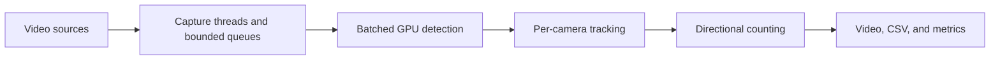

# Multi-Camera Traffic Analytics

Vehicle detection, tracking, and directional counting across four traffic video
streams. Built with Python, YOLO26m, ONNX Runtime, and ByteTrack as a personal
computer vision project.

## Features

- Batched GPU inference across independent camera feeds.
- Per-camera vehicle tracking with persistent IDs.
- Configurable road regions and directional counting lines.
- Annotated H.264 video, CSV tracks and events, and JSON metrics.
- Bounded frame queues that discard older frames when processing falls behind.

## How it works



Each camera has its own capture thread and tracker. A shared ONNX Runtime session
processes batches of four frames. Vehicle tracks are counted when their
bottom-center crosses a configured line in the permitted direction.

The demo uses four independent UA-DETRAC sequences played at 25 FPS. Tracking
identities belong to individual cameras; vehicles are not matched across views.

## Requirements

Tested on Ubuntu under WSL2 with Python 3.14.4 and an NVIDIA RTX 3060 (12 GB).
The GPU setup uses CUDA 13, cuDNN 9, and ONNX Runtime 1.28.0.

You also need FFmpeg with `libx264` and `h264_nvenc`, plus `ffprobe`. Install
compatible NVIDIA drivers and runtime libraries separately from the Python
packages.

## Installation

Run from the repository root:

```bash
python3 -m venv venv
source venv/bin/activate
python -m pip install -r requirements.txt
```

Place the exported model at `models/yolo26m.onnx`. The expected export uses FP16
weights, float32 input `[4, 3, 640, 640]`, and end-to-end output `[4, 300, 6]`.
Model files are not included or downloaded automatically. The inference engine
looks for CUDA/cuDNN libraries in the virtual environment's NVIDIA packages.

To prepare the demo data, install the Kaggle CLI and configure its authentication:

```bash
python -m pip install kaggle
bash scripts/setup_ua_detrac.sh solesensei/solesensei_uadtrac \
  MVI_20011 MVI_20012 MVI_20032 MVI_20052
```

This creates four local videos and `data/manifests/ua_detrac_selected.yaml`.
Access to the dataset requires an available Kaggle source and account permissions.

## Usage

Run the full 60-second demo:

```bash
python -m src.main --config configs/phase4_analytics_demo.yaml
```

Edit the YAML to change camera regions, counting lines, output paths, or run
duration. ROI and line coordinates are normalized to the 640×640 letterboxed
image. Camera sources are defined in the manifest.

To inspect detections alongside tracks, set `show_detections: true` in the
configuration's `output` section. Cyan boxes show accepted detections and their
confidence; yellow boxes show track IDs; green lines mark counting gates. The
option defaults to off when omitted. Predictions below the configured confidence
threshold are not displayed.

The demo writes to `outputs/phase4_demo/`:

| File | Contents |
|---|---|
| `cam_XX.mp4` | Annotated video for each camera |
| `tracks.csv` | Vehicle IDs, positions, classes, and source timestamps |
| `events.csv` | Individual line-crossing events |
| `counts.csv` | Cumulative counts by camera, line, direction, and class |
| `metrics.json` | Throughput, latency, drops, and processing timings |

Rerunning the demo overwrites those files. Data, models, and generated outputs
are excluded from Git.

## Results

Measured on the RTX 3060 with four 25 FPS inputs, a 640×640 model input, and
batch size four. Each run lasts 60 seconds.

| Configuration | Processed FPS | Frame drop | p95 latency | Measurement |
|---|---:|---:|---:|---|
| Detection | 91.61 | 7.41% | 447.77 ms | Median of 3 runs |
| Detection + tracking | 67.06 | 31.84% | 466.83 ms | Median of 3 runs |
| Full analytics + annotated video | 57.14 | 41.42% | 479.97 ms | Single run |

The compute comparisons disable CSV and video output. The full run includes the
optional detection overlay and recorded no video-only drops. Latency measures
consumer-side processing, excluding asynchronous encoding completion.

A manual check of four camera/direction combinations across two clips found
counts within **0–2 vehicles** of the manual totals. The reviewed intervals were
23 and 30 seconds. This is an initial functional check; broader evaluation is
still needed.

To repeat the detection/tracking comparison:

```bash
python scripts/run_controlled_benchmarks.py --runs 3
```

## Tests

```bash
python -m unittest discover -s tests -v
```

The 37 tests cover tracking isolation, frame gaps, counting geometry, CSV output,
and asynchronous video handling. They run without GPU inference; video tests
require FFmpeg and FFprobe.

## Limitations

- Input is simulated live video from files; live-stream recovery is not implemented.
- Processing does not keep up with every frame from four 25 FPS inputs.
- Counting quality depends on the scene, detections, tracking, and gate placement.
- Saved videos omit dropped frames, so playback is shorter than the source timeline.
- The fixed batch-four setup needs changes to support more than four cameras.

## Future work

- A simple traffic-state indicator, such as vehicle occupancy in a road region.
- Wider counting evaluation and performance comparisons.
- Reproducible model export and live camera support.

## Dataset

The demo uses UA-DETRAC. Dataset media is not distributed with this repository;
follow its attribution and distribution terms when preparing public demos.
