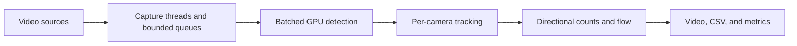
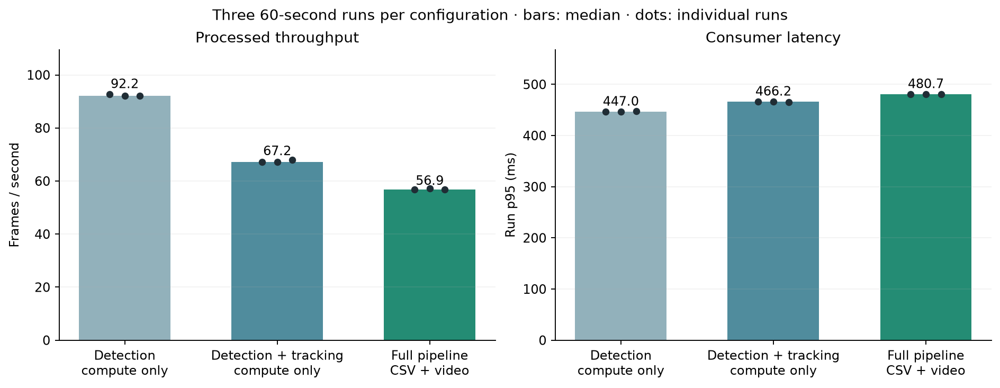

# Multi-Camera Traffic Analytics

Vehicle detection, tracking, and directional traffic flow across four video
streams. A personal computer vision project built with Python, YOLO26m,
ONNX Runtime, and ByteTrack.

## Features

- Batched GPU detection and independent tracking for each camera.
- Configurable road regions and directional crossing gates.
- Traffic flow in vehicles/minute over a rolling 15-second window.
- CSV events, performance metrics, annotated videos, and a four-camera showcase.
- A local browser dashboard with live processing of the four looping clips.



Tracks are counted when their bottom-center crosses a gate in the configured
direction. Queues discard older frames when processing falls behind.

## Setup

Tested on Ubuntu/WSL2 with Python 3.14.4 and an NVIDIA RTX 3060 (12 GB,
driver 610.88). Install FFmpeg with `libx264`, `h264_nvenc`, and `ffprobe`.
`requirements.txt` pins the complete tested environment: Python packages,
CUDA 13/cuDNN 9 libraries, export tools, and plotting dependencies.

```bash
python3 -m venv venv
source venv/bin/activate
python -m pip install -r requirements.txt
```

Download the [YOLO26m weights](https://github.com/ultralytics/assets/releases/download/v8.4.0/yolo26m.pt)
to `models/yolo26m.pt`, then export:

```bash
python -m scripts.export_model --weights models/yolo26m.pt --output models/yolo26m.onnx
```

The export uses FP16 weights, float32 input `[4,3,640,640]`, and native end-to-end
output `[4,300,6]`. Existing models are not overwritten.
[Weight checksum and export settings](data/manifests/model_reference.yaml).

Prepare the sources with an authenticated Kaggle CLI:

```bash
python -m pip install kaggle
bash scripts/setup_ua_detrac.sh solesensei/solesensei_uadtrac \
  MVI_20011 MVI_20012 MVI_20032 MVI_20052
python -m scripts.check_environment
```

Use `--archive /path/to/dataset.zip` for an existing archive. Setup validates frame
numbering and reuses verified outputs. The environment check verifies source
reading, model interfaces, CUDA inference, and NVENC. Local preparation and clean
environment setup were tested; Kaggle download requires external access.

## Recorded showcase

```bash
python -m src.main
python -m scripts.render_demo
```

The default configuration, `configs/default.yaml`, runs the full demo for 60 seconds. Use
`--config <path>` to select another configuration.

Watch `outputs/demo/showcase.mp4` for all four cameras, track IDs,
directional gates, crossing totals, and flow. If the recorded run is current,
run only the rendering command; it uses saved results without repeating inference.

The four independent file sources loop at 25 FPS. The showcase holds each processed
image until the next observation to preserve source timing and is labeled as
recorded replay. Per-camera videos, tracks, events, counts, flow, frame indexes,
configuration snapshots, and metrics share the same output folder. Rerunning
replaces those outputs; generated data stays out of Git.

Edit `analytics.flow.window_s` to change the flow window. Startup rates are marked
as warming up. ROI and gate coordinates use the normalized 640×640 letterboxed
image. Set `output.show_detections: true` for diagnostic detection boxes.

## Live dashboard

After setup, start the pipeline and open [localhost:8000](http://localhost:8000)
in your browser:

```bash
source venv/bin/activate
python -m src.main --dashboard
```

The dashboard shows all four looping clips with current track IDs, directional
gates, crossing totals, and rolling vehicles/minute. Detections and counts are
computed as the clips run. This is live processing of recorded footage; the
scenes are independent. The existing CUDA setup is required, with no additional
Python dependencies.

It runs until **Ctrl+C** in the terminal. Counts accumulate across clip loops and
reset when the process restarts; refreshing the browser preserves the session.
The flow window and geometry come from `configs/default.yaml`. Warmup and stalled
feeds are labeled, and the **Fullscreen** button expands the display.

Use `python -m src.main --dashboard --port 8001` if port 8000 is occupied, then
open `http://localhost:8001`. The server listens only on the local machine.

Dashboard mode disables video and CSV recording and leaves the recorded showcase
intact. On shutdown, it writes session metrics to `outputs/dashboard/metrics.json`.
Timing and detection-distribution samples are limited to the latest 2,000 values
for this long-running mode; crossing totals remain cumulative. The performance
table below measures the recorded pipeline, not browser-dashboard performance.

## Results

Three 60-second runs per configuration on the RTX 3060, with four 25 FPS inputs,
640×640 inference, and batch size four. Values below are medians.

| Configuration | Processed FPS | Frame drop | Run p95 latency |
|---|---:|---:|---:|
| Detection only | 92.21 | 6.81% | 447.00 ms |
| Detection + tracking | 67.22 | 31.67% | 466.17 ms |
| Full pipeline + video | 56.89 | 41.88% | 480.70 ms |

The first two configurations disable CSV/video output. The full pipeline includes
15-second flow, CSVs, and four NVENC videos, with diagnostic boxes off. No video-only
drops occurred. Latency excludes asynchronous encoding completion.



The representative full run differed from manual counts by **0–2 vehicles** across
four camera/direction comparisons in 23- and 30-second intervals. These are small
count checks, not a general accuracy estimate.

[Directional flow](assets/results/traffic_flow.png) ·
[Manual count comparison](assets/results/count_comparison.png) ·
[Measurements and provenance](assets/results/results.json)

To repeat the measurements and generate all three figures:

```bash
python scripts/run_controlled_benchmarks.py --runs 3
python -m scripts.plot_results --suite outputs/final_benchmarks/TIMESTAMP
```

Replace `TIMESTAMP` with the suite printed by the runner. Suites retain raw results,
input hashes, configurations, and environment details; interrupted runs support
`--resume <suite-path>`. Manual comparisons require the reviewed source fingerprints.

## Tests

```bash
python -m unittest discover -s tests -v
```

Tests cover tracking, crossings, flow, replay, output, and reproducibility helpers.
They run without GPU inference; video tests require FFmpeg and FFprobe, and the
dashboard HTTP test requires permission to bind a localhost port.

## Project layout

| Path | Contents |
|---|---|
| `src/` | Capture, inference, tracking, analytics, metrics, and output |
| `configs/` | Default demo and detection/tracking compute benchmarks |
| `scripts/` | Dataset setup, model export, checks, benchmarks, plots, and replay |
| `tests/` | Automated behavior and regression tests |
| `data/manifests/`, `assets/results/` | Input references and published results |
| `assets/dashboard.html` | Self-contained browser dashboard |

Datasets, model weights, generated `outputs/`, and local historical `artifacts/`
are excluded from Git.

## Limitations

- File replay only; live camera ingestion and recovery are future work.
- Four 25 FPS inputs exceed the full pipeline's processing rate.
- Counting depends on detections, tracking, camera motion, and gate placement.
- Camera identities are independent; there is no cross-camera vehicle matching.
- Individual camera videos omit dropped frames; the showcase preserves timing.

## Attribution

Footage: [UA-DETRAC](https://arxiv.org/abs/1511.04136). Model and pretrained weights:
Ultralytics YOLO26, subject to its [license terms](https://www.ultralytics.com/license).
Dataset media and model weights are not distributed with this repository.
