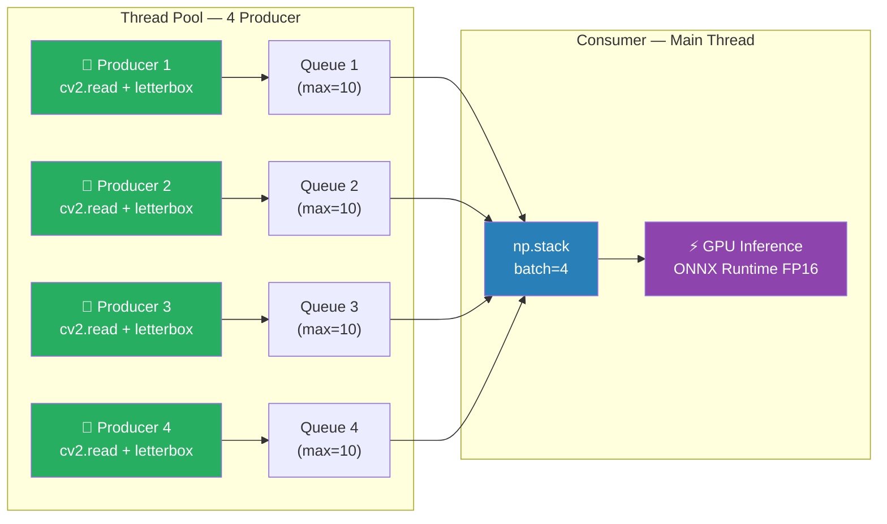
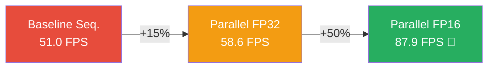

# 📊 cv-multi-monitoring — Report Benchmark v2 (FP16)

> **Data:** 7 Agosto 2026  
> **Ambiente:** WSL2 Ubuntu · NVIDIA RTX 3060 12GB · AMD Ryzen 5 1600 · 8GB RAM  
> **Modello:** YOLO26m ONNX FP16 (20.4M parametri, 68.4 GFLOPs)  
> **Video di test:** 4× car-detection 768×432 (Intel IoT DevKit)

---

## 🖥️ Ambiente Hardware & Software

| Componente | Dettaglio |
|:---|:---|
| GPU | NVIDIA GeForce RTX 3060 (12,287 MB VRAM, Tensor Cores) |
| CPU | AMD Ryzen 5 1600 Six-Core (12 thread) |
| RAM | 7.73 GB |
| PyTorch | 2.13.0+cu130 |
| ONNX Runtime | 1.28.0 (CUDAExecutionProvider) |
| CUDA | 13.0 |
| cuDNN | 9.x |
| Ultralytics | 8.4.115 |

---

## 🧪 Configurazione dei Test

| Parametro | Valore |
|:---|:---|
| Stream video | 4 (stream1–4.mp4) |
| Risoluzione video | 768 × 432 |
| Input modello | 640 × 640 (letterbox) |
| Frame per stream | 150 |
| Frame totali | 600 |
| Modello | YOLO26m ONNX end2end (NMS integrato) |
| Soglia confidenza | 0.25 |

---

## 📈 Risultati — Confronto Completo a 3 Pipeline

### Tabella Comparativa

| Metrica | Baseline Seq. | Parallel FP32 | Parallel FP16 |
|:---|:---:|:---:|:---:|
| **Architettura** | Singolo thread | 4 Producer + Consumer | 4 Producer + Consumer |
| **Batching** | No (1 frame) | Sì (batch=4) | Sì (batch=4) |
| **Precisione** | FP32 | FP32 | **FP16** |
| **Preprocessing** | Sequenziale | Parallelo (4 thread) | Parallelo (4 thread) |
| **Dimensione modello** | 78.2 MB | 78.2 MB | **39.2 MB (−50%)** |
| **Frame totali** | 600 | 600 | 600 |
| **Detections totali** | 232 | 232 | **232 ✓** |
| **Tempo totale** | 11.81 s | 10.23 s | **6.82 s** |
| **Throughput globale** | **51.0 FPS** | **58.6 FPS** | **87.9 FPS** 🚀 |
| **Throughput per camera** | **12.7 FPS** | **14.7 FPS** | **22.0 FPS** 🚀 |
| **Speedup vs Baseline** | — | +15.0% | **+72.4%** |

> [!IMPORTANT]
> Le detections sono **identiche** (232) in tutte e 3 le pipeline — il passaggio a FP16 **non ha causato alcuna perdita di accuratezza** rilevabile su questo dataset.

---

### 📊 Andamento FPS durante l'elaborazione

````carousel
```
Baseline Sequenziale (FP32, singolo thread)
───────────────────────────────────────────
step  30/150:  120 frame — 47.9 FPS
step  60/150:  240 frame — 49.8 FPS
step  90/150:  360 frame — 50.2 FPS
step 120/150:  480 frame — 50.6 FPS
step 150/150:  600 frame — 50.8 FPS
                           ════════
                           ~51.0 FPS globali
```
<!-- slide -->
```
Parallel Batched Engine (FP32, batch=4)
───────────────────────────────────────
batch  30/150:  120 frame — 58.5 FPS
batch  60/150:  240 frame — 58.3 FPS
batch  90/150:  360 frame — 58.2 FPS
batch 120/150:  480 frame — 58.3 FPS
batch 150/150:  600 frame — 58.6 FPS
                             ════════
                             ~58.6 FPS globali
```
<!-- slide -->
```
Parallel Batched Engine (FP16, batch=4) 🚀
──────────────────────────────────────────
batch  30/150:  120 frame — 86.2 FPS
batch  60/150:  240 frame — 87.0 FPS
batch  90/150:  360 frame — 87.2 FPS
batch 120/150:  480 frame — 87.2 FPS
batch 150/150:  600 frame — 87.9 FPS
                             ════════
                             ~87.9 FPS globali
```
````

> [!TIP]
> Tutte le pipeline mostrano throughput **stabile** dopo il warm-up — nessun memory leak né degradazione progressiva.

---

## 🏗️ Architettura — Parallel Batched Engine



**3 fonti di ottimizzazione cumulative:**

| # | Ottimizzazione | Contributo |
|:---|:---|:---|
| 1 | **Video decode + preprocess parallelo** (4 thread) | Elimina attese I/O sulla GPU |
| 2 | **GPU batching** (batch=4 in 1 passaggio) | Migliore utilizzo dei CUDA cores |
| 3 | **FP16 inference** (Tensor Cores) | Raddoppia il throughput computazionale |

---

## ⏱️ Timeline delle Ottimizzazioni



| Step | FPS | Speedup cumulativo | Tecnica chiave |
|:---|:---:|:---:|:---|
| Baseline sequenziale | 51.0 | — | Ultralytics + ONNX, singolo thread |
| + Threading + Batching | 58.6 | +15.0% | 4 producer threads, batch=4 |
| + **FP16** | **87.9** | **+72.4%** | Half precision, Tensor Cores RTX 3060 |

---

## 🔍 Analisi dei Bottleneck (FP16)

| Componente | Tempo stimato/batch | Nota |
|:---|:---|:---|
| Video decode (cv2.read × 4) | ~2 ms | Parallelizzato, non bottleneck |
| Preprocessing (letterbox × 4) | ~6 ms | Parallelizzato, non bottleneck |
| np.stack (batch assembly) | ~0.5 ms | Trascurabile |
| **GPU inference FP16 (batch=4)** | **~10 ms** | **Bottleneck principale** |
| **Totale per batch** | **~11 ms** | ~90.9 FPS teorici |

> [!NOTE]
> Il throughput misurato (87.9 FPS) è vicino al limite teorico (~91 FPS), confermando che la pipeline è ben bilanciata. Il gap residuo (~3%) è overhead di sincronizzazione thread + GIL Python.

---

## 📁 File del Progetto

```
cv-multi-monitoring/
├── data/videos/
│   ├── stream1.mp4               (2.7 MB)
│   ├── stream2.mp4               (2.7 MB)
│   ├── stream3.mp4               (2.7 MB)
│   └── stream4.mp4               (2.7 MB)
├── models/
│   ├── yolo26m.onnx              (39.2 MB, batch=4, FP16) ← attuale
│   ├── yolo26m_dynamic.onnx      (78.2 MB, batch=1, FP32, legacy)
│   └── yolo26m.pt                (42.2 MB, pesi PyTorch originali)
├── src/
│   ├── baseline_seq.py           ← Baseline sequenziale (~51 FPS)
│   └── parallel_engine.py        ← Pipeline ottimizzata (~88 FPS)
├── artifacts/
│   └── walkthroughParal1.md      ← Report benchmark v1
└── venv/                         (ambiente virtuale Python)
```

---

## 🚀 Prossime Ottimizzazioni Possibili

| Ottimizzazione | Speedup atteso | Da 87.9 FPS a… | Complessità |
|:---|:---|:---:|:---|
| **TensorRT** (compilazione nativa GPU) | +30–50% | ~115–130 FPS | Media |
| **IO Binding** (zero-copy GPU tensors) | +5–10% | ~92–97 FPS | Bassa |
| **Async inference** (overlap batch N+1) | +5–10% | ~92–97 FPS | Media |
| **Batch=8** (se preprocessing regge) | +5–15% | ~92–101 FPS | Bassa |
| **CUDA Streams** (multi-stream overlap) | +10–15% | ~97–101 FPS | Alta |

> [!TIP]
> Con **TensorRT** si potrebbe superare i **120 FPS globali** (30+ FPS per camera), raggiungendo il vero real-time a 30fps per tutti e 4 gli stream simultaneamente.

---

## ✅ Conclusioni

- **FP16 è il miglior rapporto costo/beneficio**: zero modifiche al codice, modello dimezzato, +72% throughput, qualità identica
- **22 FPS per camera** sono sufficienti per la maggior parte degli scenari di videosorveglianza (tipicamente 15–25 FPS)
- La RTX 3060 con i **Tensor Cores** è perfetta per FP16 — il boost è quasi lineare
- Il prossimo "big jump" sarebbe TensorRT per compilazione GPU nativa
