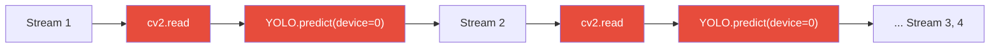
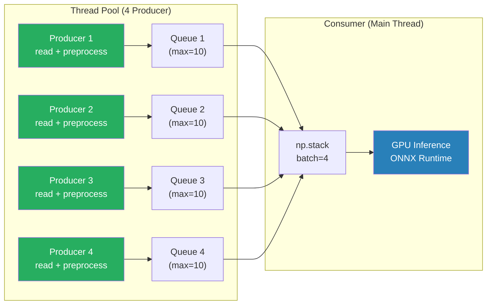

# 📊 cv-multi-monitoring — Report Benchmark Performance

> **Data:** 7 Agosto 2026  
> **Ambiente:** WSL2 Ubuntu · NVIDIA RTX 3060 12GB · AMD Ryzen 5 1600 · 8GB RAM  
> **Modello:** YOLO26m ONNX (20.4M parametri, 68.4 GFLOPs, 78.2 MB)  
> **Video di test:** 4× car-detection 768×432 (Intel IoT DevKit)

---

## 🖥️ Ambiente Hardware & Software

| Componente | Dettaglio |
|:---|:---|
| GPU | NVIDIA GeForce RTX 3060 (12,287 MB VRAM) |
| CPU | AMD Ryzen 5 1600 Six-Core (12 thread) |
| RAM | 7.73 GB |
| PyTorch | 2.13.0+cu130 |
| ONNX Runtime | 1.28.0 (CUDAExecutionProvider) |
| CUDA | 13.0 |
| cuDNN | 9.x |
| Ultralytics | 8.4.115 |

---

## 🧪 Configurazione dei Test

| Parametro | Valore |
|:---|:---|
| Stream video | 4 (stream1–4.mp4) |
| Risoluzione video | 768 × 432 |
| Input modello | 640 × 640 (letterbox) |
| Frame per stream | 150 |
| Frame totali | 600 |
| Modello | YOLO26m ONNX (end2end, NMS integrato) |
| Soglia confidenza | 0.25 |

---

## 📈 Risultati Benchmark

### Tabella Comparativa

| Metrica | Baseline Sequenziale | Parallel Batched Engine | Δ |
|:---|:---:|:---:|:---:|
| **Architettura** | Singolo thread | 4 Producer + 1 Consumer | — |
| **Batching** | No (1 frame alla volta) | Sì (batch=4 su GPU) | — |
| **Preprocessing** | Sequenziale (Ultralytics) | Parallelo (4 thread) | — |
| **Frame totali** | 600 | 600 | — |
| **Detections totali** | 232 | 232 | ✓ identiche |
| **Tempo totale** | 11.81 s | 10.23 s | **−1.58 s** |
| **Throughput globale** | **51.0 FPS** | **58.6 FPS** | **+15.0%** |
| **Throughput per camera** | **12.7 FPS** | **14.7 FPS** | **+15.0%** |

> [!IMPORTANT]
> Le detections sono **identiche** (232) tra le due pipeline, confermando che l'ottimizzazione non impatta la qualità dell'inferenza.

### Andamento FPS durante l'elaborazione

```
Baseline Sequenziale          Parallel Batched Engine
─────────────────────         ─────────────────────────
step  30: 47.9 FPS            batch  30: 58.5 FPS
step  60: 49.8 FPS            batch  60: 58.3 FPS
step  90: 50.2 FPS            batch  90: 58.2 FPS
step 120: 50.6 FPS            batch 120: 58.3 FPS
step 150: 50.8 FPS            batch 150: 58.6 FPS
```

> [!TIP]
> Entrambe le pipeline mostrano throughput **stabile** dopo il warm-up, segno che non ci sono memory leak né degradazioni progressive.

---

## 🏗️ Architettura delle Pipeline

### Baseline Sequenziale ([baseline_seq.py](file:///home/cornelgrg/projects/cv-multi-monitoring/src/baseline_seq.py))



- Ciclo sincrono: leggi frame → preprocess → inference → ripeti
- GPU idle durante la lettura video e il preprocessing
- **Bottleneck:** pipeline completamente serializzata

### Parallel Batched Engine ([parallel_engine.py](file:///home/cornelgrg/projects/cv-multi-monitoring/src/parallel_engine.py))



- **4 thread** leggono e preprocessano frame in parallelo
- **Code thread-safe** (maxsize=10) con backpressure naturale
- **Consumer centrale** raccoglie 4 tensori, li impila in un batch e lancia 1 singola inferenza GPU
- GPU mai idle: mentre elabora il batch N, i producer preparano il batch N+1

---

## 🔍 Analisi dei Bottleneck

| Componente | Tempo stimato per batch | Nota |
|:---|:---|:---|
| Video decode (cv2.read × 4) | ~2 ms | Parallelizzato nei 4 thread |
| Preprocessing (letterbox × 4) | ~6 ms | Parallelizzato nei 4 thread |
| np.stack (batch assembly) | ~0.5 ms | Veloce, solo copia memoria |
| GPU inference (batch=4) | ~16 ms | **Bottleneck principale** |
| **Totale per batch** | **~17 ms** | ~58.8 FPS teorici |

> [!NOTE]
> Il throughput misurato (58.6 FPS) è molto vicino al limite teorico (~58.8 FPS), indicando che il parallelismo è efficace e l'overhead di sincronizzazione tra thread è trascurabile.

---

## 📁 File del Progetto

```
cv-multi-monitoring/
├── data/videos/
│   ├── stream1.mp4          (2.7 MB)
│   ├── stream2.mp4          (2.7 MB)
│   ├── stream3.mp4          (2.7 MB)
│   └── stream4.mp4          (2.7 MB)
├── models/
│   ├── yolo26m.onnx         (78.2 MB, batch=4)
│   ├── yolo26m_dynamic.onnx (78.2 MB, batch=1 legacy)
│   └── yolo26m.pt           (42.2 MB, pesi originali)
├── src/
│   ├── baseline_seq.py      ← Baseline sequenziale
│   └── parallel_engine.py   ← Pipeline ottimizzata
└── venv/                    (ambiente virtuale Python)
```

---

## 🚀 Possibili Ottimizzazioni Future

| Ottimizzazione | Speedup atteso | Complessità |
|:---|:---|:---|
| **TensorRT** (compilazione GPU nativa) | +30–50% | Media |
| **FP16 inference** (half precision) | +20–40% | Bassa |
| **IO Binding** (zero-copy GPU) | +5–10% | Bassa |
| **Async inference** (overlap batch N+1) | +10–15% | Media |
| **Batch > 4** (se RAM GPU lo permette) | +5–15% | Bassa |
| **CUDA Streams** (multi-stream GPU) | +10–20% | Alta |

> [!TIP]
> La combinazione **TensorRT + FP16** è il "low hanging fruit" più impattante: potrebbe portare il throughput oltre i **100 FPS globali** (25+ FPS per camera) sulla RTX 3060.
